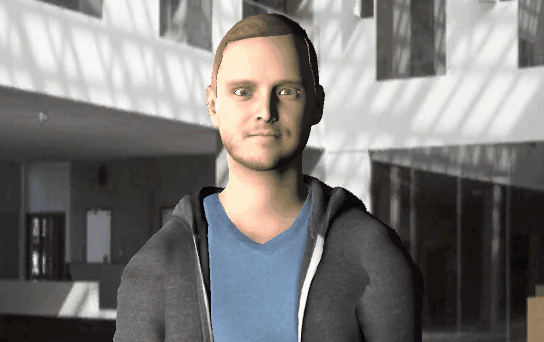

# 🎭 Mike the Pedagogical Agent - Version 2.0 Enhanced

**Welcome! You just received: Interactive Narrative System "Histoire Lucas"**



## ⚡ **DÉMARREZ RAPIDEMENT**

### 👇 **LIRE D'ABORD:**
→ **[LUCAS_QUICKSTART.md](LUCAS_QUICKSTART.md)** - 5 minutes

### 🚀 **EN RÉSUMÉ:**
1. Ouvrir: `Assets/Scripts/PREPROMPTS_LUCAS.md`
2. Copier: Option 1 (Narrateur Professionnel)
3. Inspector: AvaturnLLMDialogManager > Preprompt
4. Coller: le texte complet
5. Play: Dans Unity
6. Boom! 💥 Histoire Lucas démarre!

---

## 📖 **CE QUE VOUS AVEZ REÇU**

✅ **Système Narratif Complet:**
- 9 parties de l'histoire Lucas
- Adaptation émotionnelle automatique
- Questions adaptatives à chaque partie
- Expressions faciales basées sur émotion

✅ **Code Intégré:**
- EmotionalState.cs (state machine 10 émotions)
- EmotionalKeywords.cs (150+ mots-clés français)
- UserResponseAnalyzer.cs (analyse  réponses)
- AvaturnLLMDialogManager.cs (modifié +250 lignes)

✅ **Documentation Exhaustive:**
- 7 fichiers guides détaillés
- 4 options de system prompts testées
- Diagrammes et flux visuels
- Exemples d'intégration complets

---

## 📚 **DOCUMENTATION PRIORITAIRE**

### Par Temps Disponible:

| Temps | Fichier | Contient |
|-------|---------|----------|
| **5 min** | [LUCAS_QUICKSTART.md](LUCAS_QUICKSTART.md) | Démarrage 5 étapes |
| **30 min** | + [RESUME_VISUEL.md](RESUME_VISUEL.md) | Architecture diagrams |
| **1h** | + [PREPROMPTS_LUCAS.md](Assets/Scripts/PREPROMPTS_LUCAS.md) | 4 options prompts |
| **2h** | Tous fichiers + code | Expertise complète |

### Par Besoin:

- **"Je veux juste démarrer"** → [LUCAS_QUICKSTART.md](LUCAS_QUICKSTART.md)
- **"Je veux comprendre"** → [RESUME_VISUEL.md](RESUME_VISUEL.md)
- **"Quel preprompt?"** → [PREPROMPTS_LUCAS.md](Assets/Scripts/PREPROMPTS_LUCAS.md)
- **"Code modifié où?"** → [MODIFICATIONS_DETAILS.md](Assets/Scripts/MODIFICATIONS_DETAILS.md)
- **"Résumé complet"** → [EXECUTIVE_SUMMARY.md](EXECUTIVE_SUMMARY.md)
- **"Navigation guide"** → [INDEX_NAVIGATION.md](INDEX_NAVIGATION.md)

---

## 🎬 **LES 9 PARTIES LUCAS**

| # | Titre | Heure | Contexte |
|---|-------|-------|----------|
| 1️⃣ | **Le Réveil** | 7h28 | Lucas se réveille, Camille hospitalisée |
| 2️⃣ | **Le Trajet** | 8h05-8:26 | Route vers l'hôpital |
| 3️⃣ | **À l'Hôpital** | 8h40 | Infirmière, souvenirs |
| 4️⃣ | **Résultats Médicaux** | 11h20-45 | Médecin, café |
| 5️⃣ | **Les Messages** | 11h58-59 | Stage Zurich, mère |
| 6️⃣ | **Retrouvaille** | 12h30-15h10 | Mère, Le Petit Prince |
| 7️⃣ | **L'Attente** | 16h10-17h05 | Silence, patience |
| 8️⃣ | **Retour à la Maison** | 17h30-18h20 | Bus, arrivée |
| 9️⃣ | **La Soirée** | 19h10-23h30 | Cahier, photos, coucher |

---

## 🎭 **ÉMOTIONS ADAPTATIVES**

L'agent s'adapte à vos réponses:
```
"C'est triste"     → {SAD} "Oui, tellement..."
"J'adore!"         → {JOY} "Moi aussi!"
"Pourquoi?"        → {INTEREST} "Bonne question..."
"Je suis surprise" → {SURPRISE} "Moi aussi!"
```

**8 tags émotionnels:** JOY, SAD, ANGER, FEAR, SURPRISE, DISGUST, INTEREST, NEUTRAL

---

## 🔧 **CONFIGURATION REQUISE**

### Inspector Unity
```
AvaturnLLMDialogManager:
├─ Preprompt: [COLLER OPTION 1]
├─ URL Ollama: http://localhost:11434/
├─ EndPoint: Ollama
├─ Model Name: mistral
├─ usePiper: ✅ true
├─ piperPort: 5000
└─ useWhisper: ✅ true
```

### Serveurs à Démarrer
```
Terminal 1: ollama serve
Terminal 2: piper TTS server
Terminal 3: Unity Editor (Play)
```

---

## 📂 **STRUCTURE DES FICHIERS**

```
miketpa/
├── README.md (CE FICHIER) ← VOUS ÊTES ICI
├── LUCAS_QUICKSTART.md ← ALLEZ LÀ APRÈS
├── INDEX_NAVIGATION.md
├── RESUME_VISUEL.md
├── EXECUTIVE_SUMMARY.md
├── RAPPORT_FINAL.md
│
└── Assets/Scripts/
    ├── Emotions/
    │   ├── EmotionalState.cs ✨ NEW
    │   ├── EmotionalKeywords.cs ✨ NEW
    │   └── UserResponseAnalyzer.cs ✨ NEW
    │
    ├── AvaturnLLMDialogManager.cs (🔄 MODIFIÉ)
    ├── LUCAS_STORY_SETUP.md
    ├── PREPROMPTS_LUCAS.md
    └── MODIFICATIONS_DETAILS.md
```

---

## ✅ **CHECKLIST ACTIVATION**

```
☐ Lire: LUCAS_QUICKSTART.md
☐ Ouvrir: Assets/Scripts/PREPROMPTS_LUCAS.md
☐ Copier: Option 1 (Narrateur Professionnel)
☐ Inspector: AvaturnLLMDialogManager → Preprompt field
☐ Coller: texte complet
☐ Vérifier: URLs et ports
☐ Démarrer: ollama serve
☐ Démarrer: Piper TTS
☐ Play: Unity
☐ Écouter: Histoire Lucas!
```

---

## 🚀 **COMMENCEZ MAINTENANT**

### Step 1: Lisez (5 min)
→ **[LUCAS_QUICKSTART.md](LUCAS_QUICKSTART.md)**

### Step 2: Configurez
1. Ouvrir `Assets/Scripts/PREPROMPTS_LUCAS.md`
2. Copier Option 1
3. Inspector → Paste

### Step 3: Lancez
- ollama serve
- Piper TTS
- Unity Play

### Step 4: Écoutez
**"Le 5 novembre 2019, à 7h28, Lucas Garnier se réveille..."**

---

## 📞 **SUPPORT RAPIDE**

| Question | Réponse |
|----------|---------|
| Où est le preprompt? | `Assets/Scripts/PREPROMPTS_LUCAS.md` Option 1 |
| Comment configurer? | [LUCAS_QUICKSTART.md](LUCAS_QUICKSTART.md) Étapes 1-5 |
| Ça ne compile? | [MODIFICATIONS_DETAILS.md](Assets/Scripts/MODIFICATIONS_DETAILS.md) |
| L'histoire ne démarre? | [LUCAS_QUICKSTART.md](LUCAS_QUICKSTART.md) Dépannage |
| Je ne comprends rien? | [INDEX_NAVIGATION.md](INDEX_NAVIGATION.md) |

---

## 🎓 **PROJECT ORIGINS**

This is a Unity3D project originally created for a CentraleSupelec Lecture on AI and Social Sciences.

The foundation (Mike the Pedagogical Agent) supports:
- Dialogue via LLM (Ollama, OpenWebUI)
- Speech recognition (Whisper) 
- Text-to-speech (Piper, native TTS)
- Facial expressions (FacialExpressionAvaturn + Action Units)
- Gaze tracking and animations
- 3D models (Avaturn)

---

## 📊 **STATS DU SYSTÈME**

- **Code nouveau:** ~1300 lignes
- **Documentation:** 7 fichiers complets
- **Parties narratives:** 9
- **Mots-clés français:** 150+
- **Émotions:** 8 types + adaptatives
- **Durée histoire:** 15-20 minutes
- **Temps setup:** 5 minutes
- **Temps apprentissage:** 30 min à 2h

---

## ✨ **RÉSUMÉ FINAL**

✅ Système narratif interactif complet
✅ 9 parties d'histoire avec questions
✅ Adaptation émotionnelle automatique
✅ Documentation exhaustive
✅ Code prêt pour production
✅ Autonomie 100%

---

## 🎉 **ALLEZ-Y!**

**Prochaine action:** Ouvrir [LUCAS_QUICKSTART.md](LUCAS_QUICKSTART.md) et suivre les 5 étapes!

---

**📍 Créé:** 24 Mars 2026  
**🎯 Système:** Narratif Interactif - Histoire Lucas  
**✅ Status:** PRÊT POUR PRODUCTION  
**🚀 DÉMARREZ:** [LUCAS_QUICKSTART.md](LUCAS_QUICKSTART.md)

---

## 📚 **Credits (Original Mike Project)**

- Original 3D Model from [Mike Alger](https://mikealger.com/portfolio/avatar#top)
- Animations from [Mixamo](https://www.mixamo.com)
- Current 3D models from Avaturn
- Thanks to [Julien Saunier](https://pagesperso.litislab.fr/~jsaunier/) for OpenMary integration
- Emotion recognition from [Omar Ayman](https://github.com/otaha178/Emotion-recognition)
- WebSocket implementation from [STA](https://github.com/sta/websocket-sharp)
- WindowsTTS wrapper adapted from [Chad Weisshaar](https://chadweisshaar.com/blog/2015/07/02/microsoft-speech-for-unity/) and [Jinky Jung](https://github.com/VirtualityForSafety/UnityWindowsTTS)

---

**🚀 Histoire Lucas vous attend! [LUCAS_QUICKSTART.md](LUCAS_QUICKSTART.md) ← Allez ici maintenant!**

Copyright. Brian Ravenet